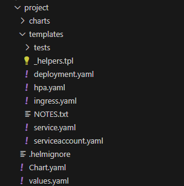

### 1.构建程序chart包

#### 1.1 创建chart模板

```shell
#执行以下命令创建chart模板
helm create project
```

目录结构如下：



#### 2.2 修改 deployment.yaml

```yaml
#模板内容，此处可以根据自己的deployment.yaml文件进行修改
apiVersion: apps/v1
kind: Deployment
metadata:
  name: {{ include "project.fullname" . }}
  labels:
    {{- include "project.labels" . | nindent 4 }}
spec:
  {{- if not .Values.autoscaling.enabled }}
  replicas: {{ .Values.replicaCount }}
  {{- end }}
  selector:
    matchLabels:
      {{- include "project.selectorLabels" . | nindent 6 }}
  template:
    metadata:
      {{- with .Values.podAnnotations }}
      annotations:
        {{- toYaml . | nindent 8 }}
      {{- end }}
      labels:
        {{- include "project.selectorLabels" . | nindent 8 }}
    spec:
      {{- with .Values.imagePullSecrets }}
      imagePullSecrets:
        {{- toYaml . | nindent 8 }}
      {{- end }}
      serviceAccountName: {{ include "project.serviceAccountName" . }}
      securityContext:
        {{- toYaml .Values.podSecurityContext | nindent 8 }}
      containers:
        - name: {{ .Chart.Name }}
          securityContext:
            {{- toYaml .Values.securityContext | nindent 12 }}
          image: "{{ .Values.image.repository }}:{{ .Values.image.tag | default .Chart.AppVersion }}"
          imagePullPolicy: {{ .Values.image.pullPolicy }}
          ports:
            - name: http
              containerPort: {{ .Values.service.port }}
              protocol: TCP
          livenessProbe:
            httpGet:
              path: /
              port: http
          readinessProbe:
            httpGet:
              path: /
              port: http
          resources:
            {{- toYaml .Values.resources | nindent 12 }}
      {{- with .Values.nodeSelector }}
      nodeSelector:
        {{- toYaml . | nindent 8 }}
      {{- end }}
      {{- with .Values.affinity }}
      affinity:
        {{- toYaml . | nindent 8 }}
      {{- end }}
      {{- with .Values.tolerations }}
      tolerations:
        {{- toYaml . | nindent 8 }}
      {{- end }}

```

#### 3. 修改service.yaml

```yaml
#模板内容，此处可以根据自己的service.yaml文件进行修改
apiVersion: v1
kind: Service
metadata:
  name: {{ include "project.fullname" . }}
  labels:
    {{- include "project.labels" . | nindent 4 }}
spec:
  type: {{ .Values.service.type }}
  ports:
    - port: {{ .Values.service.port }}
      targetPort: http
      protocol: TCP
      name: http
  selector:
    {{- include "project.selectorLabels" . | nindent 4 }}
```

#### 4. 创建configmap.yaml（可选）

> 配置管理中心。简写`cm`/
>
> 数据不能超过`1MB`。
>
> 用于保存非机密性的配置，数据可以用`key/value`键值对的形式保存，也可通过文件的形式保存。
>
> 项目配置文件统一管理。可以当作`volume`挂载到`pod`中。如`nginx`等配置。
>
> 同样可以通过 `value.yaml` 文件进行传参

```yaml
#deployment部分挂载配置样例
#之战时containers部分，其它部分省略
	containers:
      - env: null
        name: {{ .Chart.Name }}
        image: "{{ .Values.image.repository }}:{{ .Values.image.tag | default .Chart.AppVersion }}"
        imagePullPolicy: {{ .Values.image.pullPolicy }}
        ports:
        - name: http-c-0-p-0
          containerPort: {{ .Values.service.port }}
          protocol: TCP
        resources:
          {{- toYaml .Values.resources | nindent 12 }}
        volumeMounts:
        - name: project-config
          #将此目录挂载出去
          mountPath: /app/application.yml
          #配置此属性代表只挂载指定单个文件
          subPath: application.yml
      dnsPolicy: ClusterFirst
      volumes:
      #对应volumeMounts.name
      - name: cmcache-service-config
      	#挂载方式指定为configMap
        configMap:
          #configmap.yaml的名称
          name: {{ include "project.fullname" . }}-configmap
```


```yaml
#configmap.yaml文件格式样例 - 以java程序举例
apiVersion: v1
kind: ConfigMap
metadata:
  name: {{ include "cmcache-service.fullname" . }}-configmap
  namespace: {{ .Release.Namespace }}
data:
  application.yml: |+
    server:
      port: {{ .Values.service.targetPort }}
    spring:
      datasource:
        driver-class-name: {{ .Values.datasource.driverClassName }}
        url: {{ .Values.datasource.url }}
        username: {{ .Values.datasource.username }}
        password: {{ .Values.datasource.password }}
      servlet:
        multipart:
          max-file-size: 500MB
          max-request-size: 1024MB
      main:
        allow-bean-definition-overriding: true
    my:
      redisParameter:
        shName: redis
        shType: showconf
        port: 8091
    pagehelper:
      #  auto-dialect: po
      helperDialect: postgresql
      reasonable: true
      support-methods-arguments: true
      page-size-zero: true
      params: count=countSql

    logging:
      level:
        com.sitech: DEBUG
    mybatis:
      mapper-locations: classpath*:mybatis-mapper/*.xml
```

#### 5. 修改value.yaml

```yaml
#此文件为赋值文件，将需要配置的内容统一在此处管理，以下为模板文件，具体需要请根据chart内yaml配置所需传参进行改写
# Default values for project.
# This is a YAML-formatted file.
# Declare variables to be passed into your templates.
replicaCount: 1
image:
  repository: nginx
  pullPolicy: IfNotPresent
  # Overrides the image tag whose default is the chart appVersion.
  tag: ""
imagePullSecrets: []
nameOverride: ""
fullnameOverride: ""
serviceAccount:
  # Specifies whether a service account should be created
  create: true
  # Annotations to add to the service account
  annotations: {}
  # The name of the service account to use.
  # If not set and create is true, a name is generated using the fullname template
  name: ""
podAnnotations: {}
podSecurityContext: {}
  # fsGroup: 2000
securityContext: {}
  # capabilities:
  #   drop:
  #   - ALL
  # readOnlyRootFilesystem: true
  # runAsNonRoot: true
  # runAsUser: 1000
service:
  type: ClusterIP
  port: 80
ingress:
  enabled: false
  className: ""
  annotations: {}
    # kubernetes.io/ingress.class: nginx
    # kubernetes.io/tls-acme: "true"
  hosts:
    - host: chart-example.local
      paths:
        - path: /
          pathType: ImplementationSpecific
  tls: []
  #  - secretName: chart-example-tls
  #    hosts:
  #      - chart-example.local
resources: {}
  # We usually recommend not to specify default resources and to leave this as a conscious
  # choice for the user. This also increases chances charts run on environments with little
  # resources, such as Minikube. If you do want to specify resources, uncomment the following
  # lines, adjust them as necessary, and remove the curly braces after 'resources:'.
  # limits:
  #   cpu: 100m
  #   memory: 128Mi
  # requests:
  #   cpu: 100m
  #   memory: 128Mi
autoscaling:
  enabled: false
  minReplicas: 1
  maxReplicas: 100
  targetCPUUtilizationPercentage: 80
  # targetMemoryUtilizationPercentage: 80
nodeSelector: {}
tolerations: []
affinity: {}
```

#### 6. chart工程打包

```shell
#格式为 helm package ${chart工程路径}/
helm package /project/
```

