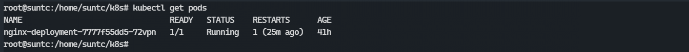

#### 1. deployment.yaml 文件详解

```yaml
apiVersion: apps/v1   			#接口版本
kind: Deployment                #接口类型
metadata:						#元数据
  name: cango-demo              #Deployment名称
  namespace: cango-prd          #命名空间
  labels:						#标签 可自定义
    app: cango-demo              
spec:					#详情描述
  replicas: 3			#副本数量
  revisionHistoryLimit: #保留历史版本，默认是10
  strategy:				#策略
    rollingUpdate:      #滚动更新, 由于replicas为3,则整个升级,pod个数在2-4个之间
      maxSurge: 1       #滚动升级时会先启动1个pod
      maxUnavailable: 1 #滚动升级时允许的最大Unavailable的pod个数
  template:             #模板，当副本数量不足时，会根据下面的模板创建pod副本
    metadata:
      labels:
        app: cango-demo  #模板名称必填
    sepc: #定义容器模板，该模板可以包含多个容器
      containers:
        - name: cango-demo                                                           #镜像名称
          image: swr.cn-east-2.myhuaweicloud.com/cango-prd/cango-demo:0.0.1-SNAPSHOT #镜像地址
          command: [ "/bin/sh","-c","cat /etc/config/path/to/special-key" ]    #启动命令
          args:                                                                #启动参数
            - '-storage.local.retention=$(STORAGE_RETENTION)'
            - '-storage.local.memory-chunks=$(STORAGE_MEMORY_CHUNKS)'
            - '-config.file=/etc/prometheus/prometheus.yml'
            - '-alertmanager.url=http://alertmanager:9093/alertmanager'
            - '-web.external-url=$(EXTERNAL_URL)'
    #如果command和args均没有写，那么用Docker默认的配置。
    #如果command写了，但args没有写，那么Docker默认的配置会被忽略而且仅仅执行.yaml文件的command（不带任何参数的）。
    #如果command没写，但args写了，那么Docker默认配置的ENTRYPOINT的命令行会被执行，但是调用的参数是.yaml中的args。
    #如果如果command和args都写了，那么Docker默认的配置被忽略，使用.yaml的配置。
          imagePullPolicy: IfNotPresent  #如果不存在则拉取
          livenessProbe:       #表示container是否处于live状态。如果LivenessProbe失败，LivenessProbe将会通知kubelet对应的container不健康了。随后kubelet将kill掉container，并根据RestarPolicy进行进一步的操作。默认情况下LivenessProbe在第一次检测之前初始化值为Success，如果container没有提供LivenessProbe，则也认为是Success；
            httpGet:
              path: /health #如果没有心跳检测接口就为/
              port: 8080
              scheme: HTTP
            initialDelaySeconds: 60 ##启动后延时多久开始运行检测
            timeoutSeconds: 5
            successThreshold: 1
            failureThreshold: 5
          readinessProbe:
            httpGet:
              path: /health #如果没有心跳检测接口就为/
              port: 8080
              scheme: HTTP
            initialDelaySeconds: 30 ##启动后延时多久开始运行检测
            timeoutSeconds: 5
            successThreshold: 1
            failureThreshold: 5
          resources:              ##CPU内存限制
            requests:
              cpu: 2
              memory: 2048Mi
            limits:
              cpu: 2
              memory: 2048Mi
          env:                    ##通过环境变量的方式，直接传递pod=自定义Linux OS环境变量
            - name: LOCAL_KEY     #本地Key
              value: value
            - name: CONFIG_MAP_KEY  #局策略可使用configMap的配置Key，
              valueFrom:
                configMapKeyRef:
                  name: special-config   #configmap中找到name为special-config
                  key: special.type      #找到name为special-config里data下的key
          ports:
            - name: http
              containerPort: 8080 #对service暴露端口
          volumeMounts:     #挂载volumes中定义的磁盘
          - name: log-cache
            mount: /tmp/log
          - name: sdb       #普通用法，该卷跟随容器销毁，挂载一个目录
            mountPath: /data/media
          - name: nfs-client-root    #直接挂载硬盘方法，如挂载下面的nfs目录到/mnt/nfs
            mountPath: /mnt/nfs
          - name: example-volume-config  #高级用法第1种，将ConfigMap的log-script,backup-script分别挂载到/etc/config目录下的一个相对路径path/to/...下，如果存在同名文件，直接覆盖。
            mountPath: /etc/config
          - name: rbd-pvc                #高级用法第2中，挂载PVC(PresistentVolumeClaim)

#使用volume将ConfigMap作为文件或目录直接挂载，其中每一个key-value键值对都会生成一个文件，key为文件名，value为内容，
  volumes:  # 定义磁盘给上面volumeMounts挂载
  - name: log-cache
    emptyDir: {}
  - name: sdb  #挂载宿主机上面的目录
    hostPath:
      path: /any/path/it/will/be/replaced
  - name: example-volume-config  # 供ConfigMap文件内容到指定路径使用
    configMap:
      name: example-volume-config  #ConfigMap中名称
      items:
      - key: log-script           #ConfigMap中的Key
        path: path/to/log-script  #指定目录下的一个相对路径path/to/log-script
      - key: backup-script        #ConfigMap中的Key
        path: path/to/backup-script  #指定目录下的一个相对路径path/to/backup-script
  - name: nfs-client-root         #供挂载NFS存储类型
    nfs:
      server: 10.42.0.55          #NFS服务器地址
      path: /opt/public           #showmount -e 看一下路径
  - name: rbd-pvc                 #挂载PVC磁盘
    persistentVolumeClaim:
      claimName: rbd-pvc1         #挂载已经申请的pvc磁盘
```

### 2. 通过 deployment.yaml 文件部署应用

#### 1. yaml 文件样例: 

```yaml
apiVersion: apps/v1
kind: Deployment
metadata:
  name: nginx-deployment
  labels:
    app: nginx
spec:
  replicas: 1
  selector:
    matchLabels:
      app: nginx
  template:
    metadata:
      labels:
        app: nginx
    spec:
      containers:
      - name: nginx
        image: nginx:latest
        imagePullPolicy: IfNotPresent
        ports:
          - containerPort: 80
```

> 此处 `nginx` 最好使用 `latest` 版本, 因为旧版本的 `nginx` 镜像 `dockerfile`  启动命令为: `nginx -g 'daemon off;'` 网络上大多自制镜像的 `nginx` 启动都以此命令进行启动, 最新版本镜像启动命令为: `/docker-entrypoint.sh nginx -g 'daemon off;'` , 此问题可能为 `docker` 版本问题

#### 2. 部署

```shell
# 应用 nginx-deployment.yaml 更新部署, 如果此部署不存在则创建
kubectl apply -f nginx-deployment.yaml
```

#### 3. 查看部署结果

```shell
# 查看 Deployment
kubectl get deployments
```


```shell
# 查看 Pod
kubectl get pods
```

