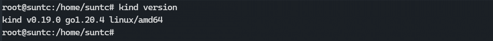
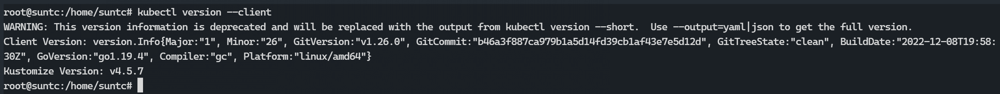
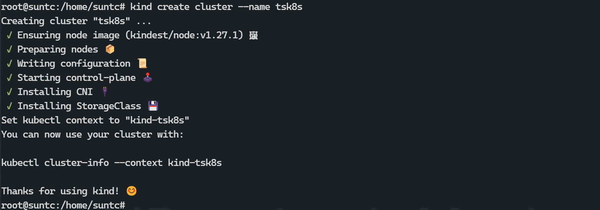
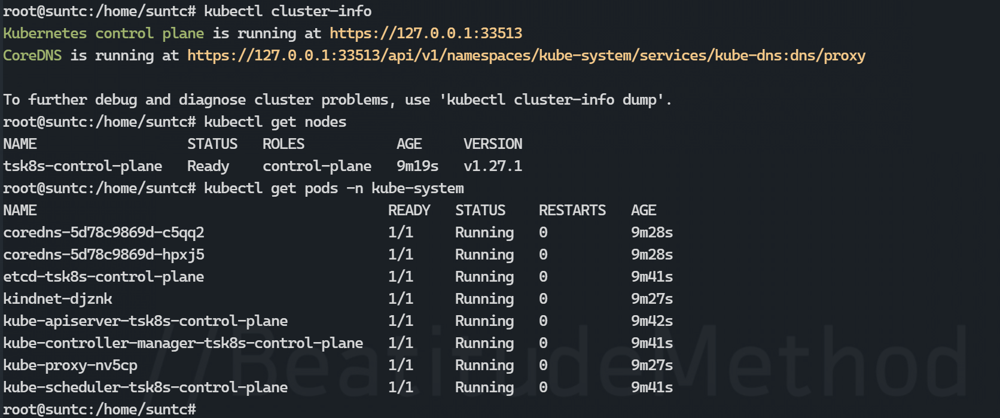

### WSL环境通过Kind工具部署K8s

#### 1. 环境准备

win10/11 下的 WSL2 : Ubuntu

Docker 环境:  24.0.0-rc.1

此处不做环境安装演示, 推荐微软官方文档: [适用于 Linux 的 Windows 子系统文档](https://learn.microsoft.com/zh-cn/windows/wsl/)

#### 2. 安装 Kind

Kind 通过 Docker 容器来运行本地的 K8s，Kind 主要用来测试 k8s，也可以用做本地 K8s 的开发环境。

Kind 的优点在于可以直接利用 Docker pull 命令取下来的镜像。

```shell
#下载kind软件
curl -Lo ./kind https://github.com/kubernetes-sigs/kind/releases/download/v0.11.1/kind-linux-amd64
#增加执行权限
chmod +x ./kind
#移动执行路径下
sudo mv ./kind /usr/local/bin/
```

> 此处由于网络原因, 可以单独下载 [kind-linux-amd64](https://github.com/kubernetes-sigs/kind/releases/download/v0.11.1/kind-linux-amd64) 后, 将文件放在工作目录下进行 `chmod +x` 赋权, 再进行 `mv` 操作



#### 3. 安装 kubectl

kind 软件本身不带 K8s 的命令行工具 kubectl，所以我们要单独下载 kubectl 安装。

运行以下命令:

```shell
curl -x -LO https://dl.k8s.io/v1.21.2/bin/linux/amd64/kubectl
chmod 755 ./kubectl
sudo mv ./kubectl /usr/local/bin/kubectl
kubectl version --client
```

> 此处由于网络原因, 处理方式可以跟 Kind 处理方式一致, 以来安装 [kubectl](https://dl.k8s.io/v1.21.2/bin/linux/amd64/kubectl)
>
> 关于简洁命令, 如: `k get pod` 可以通过修改 kubectl 文件名称来实现



#### **4. 创建 K8s Cluster**

运行下面命令创建 K8s Cluster

```shell
kind create cluster --name tsk8s
```



> 在命令执行过程中, 通过执行 `ps -ef | grep docker` 命令可以查看到此命令实际正在进行 `docker pull` 命令, 此过程较慢, 可通过执行此 `docker pull` 命令来查看执行进度

#### 5. 查看	Kind K8s 运行结构

可以通过以下命令查看 K8s 集群

```shell
#查看集群
kubectl cluster-info --context kind-tsk8s
#查看node
kubectl get nodes
#查看kube-system空间内运行的pod
kubectl get pods -n kube-system
```



> kind 创建 K8s 时，实际上是利用镜像启了一个容器而 K8s 的整个服务都运行在这个容器内部。

​	
