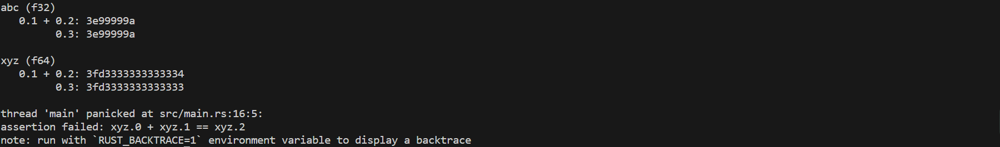

## 整数类型

| 长度       | 有符号类型 | 无符号类型 |
| ---------- | ---------- | ---------- |
| 8 位       | `i8`       | `u8`       |
| 16 位      | `i16`      | `u16`      |
| 32 位      | `i32`      | `u32`      |
| 64 位      | `i64`      | `u64`      |
| 128 位     | `i128`     | `u128`     |
| 视架构而定 | `isize`    | `usize`    |

**无符号数：**正数和0	**有符号：** 正负数和0

> 有符号数字以补码形式存储

`isize` 和 `usize` 类型取决于程序运行的计算机 CPU 类型： 若 CPU 是 32 位的，则是 32 位，CPU 是 64 位，则是 64 位。

#### 整型溢出

如值大小超过整数类型范围，会发生**整型溢出**。

在 `debug` 模式编译时，遇到整型溢出程序会 *panic* 。

在 `--release` 模式编译时，Rust不会检查整型溢出，而是会按照补码循环溢出规则处理。

> panic：崩溃，Rust 使用这个术语来表明程序因错误而退出
>
> 补码循环溢出：比如在 `u8` 的情况下，256 变成 0，257 变成 1，依此类推。

想要显示处理溢出，可使用以下方法进行处理：

- 使用 `wrapping_*` 方法在所有模式下都按照补码循环溢出规则处理，例如 `wrapping_add`
- 如果使用 `checked_*` 方法时发生溢出，则返回 `None` 值
- 使用 `overflowing_*` 方法返回该值和一个指示是否存在溢出的布尔值
- 使用 `saturating_*` 方法使值达到最小值或最大值

```rust
fn main() {
    let a : u8 = 255;
    let b: u8 = a.wrapping_add(20);
    println!("{}", b);  // 19
    let c: u8 = a.saturating_add(20);
    println!("{}", c); //255
}
```

## 浮点类型

Rust中浮点类型数字包含两种类型：`f32` 和 `f64` ，默认为 `f64`。

```rust
fn main() {
    let x = 2.0; // f64
    let y: f32 = 3.0; // f32
}
```

> 浮点数根据 `IEEE-754` 标准实现。`f32` 类型是单精度浮点型，`f64` 为双精度。

#### 浮点数陷阱

浮点数表达的数值受限制与定长的浮点精度，如果想要表达完全精准的真实数字，只有使用无线精度的浮点数。

```rust
//举例
fn main() {
  // 断言0.1 + 0.2与0.3相等
  assert!(0.1 + 0.2 == 0.3);
}
```

> 此案例会 *panic*，因为二进制精度问题，导致了 0.1 + 0.2 并不严格等于 0.3，它们可能在小数点 N 位后存在误差。
>
> 如果非要进行比较，可以考虑用这种方式 `(0.1_f64 + 0.2 - 0.3).abs() < 0.00001` ，具体小于多少，取决于你对精度的需求。

```rust
//更清晰的例子
fn main() {
    let abc: (f32, f32, f32) = (0.1, 0.2, 0.3);
    let xyz: (f64, f64, f64) = (0.1, 0.2, 0.3);

    println!("   0.1 + 0.2: {:x}", (abc.0 + abc.1).to_bits());
    println!("         0.3: {:x}", (abc.2).to_bits());
    println!();

    println!("xyz (f64)");
    println!("   0.1 + 0.2: {:x}", (xyz.0 + xyz.1).to_bits());
    println!("         0.3: {:x}", (xyz.2).to_bits());

    assert!(abc.0 + abc.1 == abc.2);
    assert!(xyz.0 + xyz.1 == xyz.2);
}
```

执行结果：



> 对 `f32` 类型做加法时，`0.1 + 0.2` 的结果是 `3e99999a`，`0.3` 也是 `3e99999a`，因此 `f32` 下的 `0.1 + 0.2 == 0.3` 通过测试，但是到了 `f64` 类型时，结果就不一样了，因为 `f64` 精度高很多，因此在小数点非常后面发生了一点微小的变化，`0.1 + 0.2` 以 `4` 结尾，但是 `0.3` 以`3`结尾，这个细微区别导致 `f64` 下的测试失败了，并且抛出了异常。

#### NaN

对于数学上未定义的结果，例如对负数取平方根 `-42.1.sqrt()` ，会产生一个特殊的结果：Rust 的浮点数类型使用 `NaN` (not a number)来处理这些情况。

**所有跟 `NaN` 交互的操作，都会返回一个 `NaN`**，而且 `NaN` 不能用来比较：

```rust
fn main() {
  let x = (-42.0_f32).sqrt();
  assert_eq!(x, x);
}
```

出于防御性编程的考虑，可以使用 `is_nan()` 等方法，可以用来判断一个数值是否是 `NaN` ：

```rust
fn main() {
    let x = (-42.0_f32).sqrt();
    if x.is_nan() {
        println!("未定义的数学行为")
    }
}
```

## 数字运算

Rust 支持所有数字类型的基本数学运算：加法、减法、乘法、除法和取模运算：

```rust
fn main() {
    // 加法
    let sum = 5 + 10;
    // 减法
    let difference = 95.5 - 4.3;
    // 乘法
    let product = 4 * 30;
    // 除法
    let quotient = 56.7 / 32.2;
    // 求余
    let remainder = 43 % 5;
}
```

这些语句中的每个表达式都使用了数学运算符，并且计算结果为一个值，然后绑定到一个变量上。[附录 B](../../7.附录/运算符与符号) 中给出了 Rust 提供的所有运算符的列表。

综合示例：

```rust
fn main() {
  // 编译器会进行自动推导，给予twenty i32的类型
  let twenty = 20;
  // 类型标注
  let twenty_one: i32 = 21;
  // 通过类型后缀的方式进行类型标注：22是i32类型
  let twenty_two = 22i32;

  // 只有同样类型，才能运算
  let addition = twenty + twenty_one + twenty_two;
  println!("{} + {} + {} = {}", twenty, twenty_one, twenty_two, addition);

  // 对于较长的数字，可以用_进行分割，提升可读性
  let one_million: i64 = 1_000_000;
  println!("{}", one_million.pow(2));

  // 定义一个f32数组，其中42.0会自动被推导为f32类型
  let forty_twos = [
    42.0,
    42f32,
    42.0_f32,
  ];

  // 打印数组中第一个值，并控制小数位为2位
  println!("{:.2}", forty_twos[0]);
}
```

## 位运算

| 运算符  | 说明                                                   |
| ------- | ------------------------------------------------------ |
| & 位与  | 相同位置均为1时则为1，否则为0                          |
| \| 位或 | 相同位置只要有1时则为1，否则为0                        |
| ^ 异或  | 相同位置不相同则为1，相同则为0                         |
| ! 位非  | 把位中的0和1相互取反，即0置为1，1置为0                 |
| << 左移 | 所有位向左移动指定位数，右位补0                        |
| >> 右移 | 所有位向右移动指定位数，带符号移动（正数补0，负数补1） |

```rust
fn main() {
    // 二进制为00000010
    let a:i32 = 2;
    // 二进制为00000011
    let b:i32 = 3;

    println!("(a & b) value is {}", a & b);

    println!("(a | b) value is {}", a | b);

    println!("(a ^ b) value is {}", a ^ b);

    println!("(!b) value is {} ", !b);

    println!("(a << b) value is {}", a << b);

    println!("(a >> b) value is {}", a >> b);

    let mut a = a;
    // 注意这些计算符除了!之外都可以加上=进行赋值 (因为!=要用来判断不等于)
    a <<= b;
    println!("(a << b) value is {}", a);
}
```

## 序列(Range)

Rust 提供了一个非常简洁的方式，用来生成连续的数值，例如 `1..5`，生成从 1 到 4 的连续数字，不包含 5 ；`1..=5`，生成从 1 到 5 的连续数字，包含 5，它的用途很简单，常常用于循环中：

```rust
for i in 1..=5 {
    println!("{}",i);
}
```

序列只允许用于数字或字符类型

```rust
for i in 'a'..='z' {
    println!("{}",i);
}
```

> 它们可以连续，同时编译器在编译期可以检查该序列是否为空，字符和数字值是 Rust 中仅有的可以用于判断是否为空的类型。

## 使用 As 完成类型转换

Rust 中可以使用 As 来完成一个类型到另一个类型的转换，其最常用于将原始类型转换为其他原始类型，但是它也可以完成诸如将指针转换为地址、地址转换为指针以及将指针转换为其他指针等功能。你可以在[这里](https://course.rs/advance/into-types/converse.html)了解更多相关的知识。

## 有理数和复数

Rust 的标准库相比其它语言，准入门槛较高，因此有理数和复数并未包含在标准库中：

- 有理数和复数
- 任意大小的整数和任意精度的浮点数
- 固定精度的十进制小数，常用于货币相关的场景

> 可以使用社区开发的[num](https://crates.io/crates/num)库
>
> 按照以下步骤来引入：
>
> 1. 创建新工程 `cargo new complex-num && cd complex-num`
> 2. 在 `Cargo.toml` 中的 `[dependencies]` 下添加一行 `num = "0.4.0"`
> 3. 将 `src/main.rs` 文件中的 `main` 函数替换为下面的代码
> 4. 运行 `cargo run`

```rust
use num::complex::Complex;

 fn main() {
   let a = Complex { re: 2.1, im: -1.2 };
   let b = Complex::new(11.1, 22.2);
   let result = a + b;

   println!("{} + {}i", result.re, result.im)
 }
```

