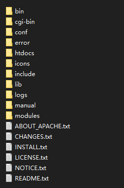

## **简介**

> ab的全称是Apache Bench，是 Apache 服务器自带的一个web压力测试工具，简称ab。
> ab又是一个命令行工具，对发起负载的本机要求很低，根据ab命令可以创建很多的并发访问线程，模拟多个访问者同时对某一URL地址进行访问，因此可以用来测试目标服务器的负载压力。
> 优点是小巧简单，上手学习较快，可以提供需要的基本性能指标。
> 缺点就是没有图形化结果，不能监控。

## 1.安装说明

### 1.1 下载地址

`windows` [Apache VS17 binaries and modules download (apachelounge.com)](https://www.apachelounge.com/download/)

`linux` **sudo yum -y install httpd-tools**

### 1.2 目录结构



### 1.3 例子

```cmd
命令: ab -n 1 -c 1 -p p.txt -T application/json "http://localhost:8998/api/gateway/getPermission"

返回结果:
This is ApacheBench, Version 2.3 <$Revision: 1903618 $>
Copyright 1996 Adam Twiss, Zeus Technology Ltd, http://www.zeustech.net/
Licensed to The Apache Software Foundation, http://www.apache.org/

Benchmarking localhost (be patient).....done


Server Software:
Server Hostname:        localhost
Server Port:            8998

Document Path:          /api/gateway/getPermission
Document Length:        142 bytes

Concurrency Level:      1
Time taken for tests:   0.545 seconds
Complete requests:      1
Failed requests:        0
Non-2xx responses:      1
Total transferred:      261 bytes
Total body sent:        586
HTML transferred:       142 bytes
Requests per second:    1.83 [#/sec] (mean)
Time per request:       544.995 [ms] (mean)
Time per request:       544.995 [ms] (mean, across all concurrent requests)
Transfer rate:          0.47 [Kbytes/sec] received
                        1.05 kb/s sent
                        1.52 kb/s total

Connection Times (ms)
              min  mean[+/-sd] median   max
Connect:        1    1   0.0      1       1
Processing:   544  544   0.0    544     544
Waiting:      543  543   0.0    543     543
Total:        545  545   0.0    545     545
```

## 2.参数说明

`-A`

> auth-username:password
>
> 对服务器提供BASIC认证信任。 用户名和密码由一个: 隔开，并以base64编码形式发送。 无论服务器是否需要(即, 是否发送了401认证需求代码)，此字符串都会被发送。

`-c`

> concurrency
>
> 一次产生的请求个数。默认是一次一个。

`-C`

> cookie-name=value 对请求附加一个Cookie: 行。 其典型形式是name=value的一个参数对。 此参数可以重复。

`-d`

> 不显示"percentage served within XX [ms] table"的消息(为以前的版本提供支持)。

 `-e`

> csv-file 产生一个以逗号分隔的(CSV)文件， 其中包含了处理每个相应百分比的请求所需要(从1%到100%)的相应百分比的(以微妙为单位)时间。 由于这种格式已经“二进制化”，所以比'gnuplot'格式更有用。

`-g`

> gnuplot-file
> 把所有测试结果写入一个'gnuplot'或者TSV (以Tab分隔的)文件。 此文件可以方便地导入到Gnuplot, IDL, Mathematica, Igor甚至Excel中。 其中的第一行为标题。

`-h`

> 显示使用方法。

 `-H`

> custom-header 对请求附加额外的头信息。
> 此参数的典型形式是一个有效的头信息行，其中包含了以冒号分隔的字段和值的对 (如, "Accept-Encoding: zip/zop; 8bit").

`-i`

> 执行HEAD请求，而不是GET。

`-k`

> 启用HTTP KeepAlive功能
> 在一个HTTP会话中执行多个请求。 默认时，不启用KeepAlive功能. -n requests 在测试会话中所执行的请求个数。 默认时，仅执行一个请求，但通常其结果不具有代表意义。

`-p`

> POST-file包含了需要POST的数据的文件.

`-P`

> proxy-auth-username:password
> 对一个中转代理提供BASIC认证信任。 用户名和密码由一个: 隔开，并以base64编码形式发送。 无论服务器是否需要(即, 是否发送了401认证需求代码)，此字符串都会被发送。

`-q`

> 如果处理的请求数大于150， ab每处理大约10%或者100个请求时，会在stderr输出一个进度计数。 此-q标记可以抑制这些信息。

`-s`

> 用于编译中(ab -h会显示相关信息)使用了SSL的受保护的https， 而不是http协议的时候。此功能是实验性的，也是很简陋的。最好不要用。

`-S`

> 不显示中值和标准背离值, 而且在均值和中值为标准背离值的1到2倍时，也不显示警告或出错信息。 默认时，会显示 最小值/均值/最大值等数值。(为以前的版本提供支持).

`-t`

> timelimit 测试所进行的最大秒数。
> 其内部隐含值是-n 50000。 它可以使对服务器的测试限制在一个固定的总时间以内。默认时，没有时间限制。

`-T`

> content-type POST数据所使用的Content-type头信息。

`-v`

> verbosity 设置显示信息的详细程度
> 4或更大值会显示头信息， 3或更大值可以显示响应代码(404, 200等), 2或更大值可以显示警告和其他信息。

`-V`

> 显示版本号并退出。

`-w`

> 以HTML表的格式输出结果。默认时，它是白色背景的两列宽度的一张表。

`-X`

> proxy[:port] 对请求使用代理服务器。
