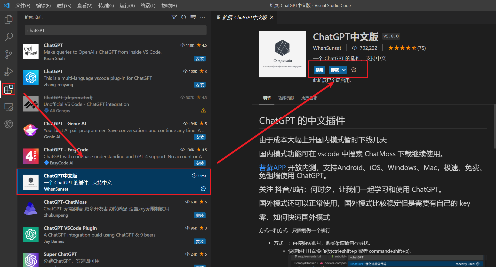
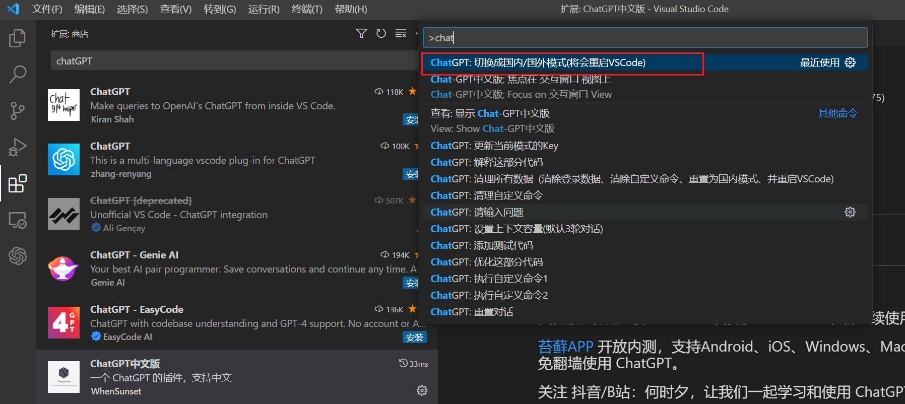
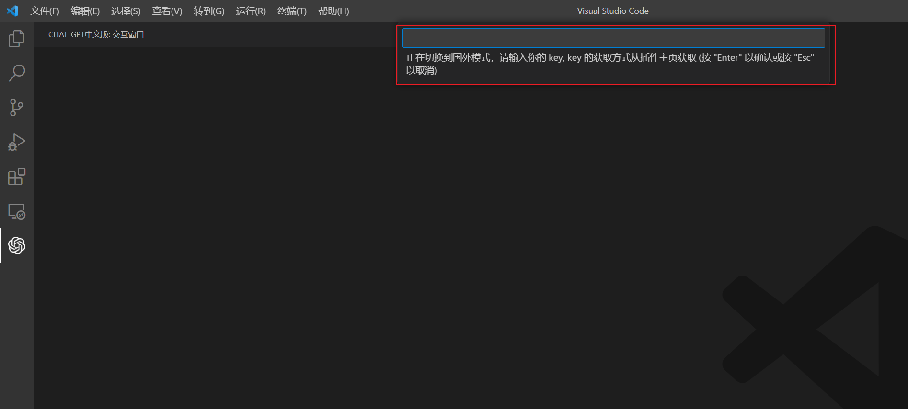
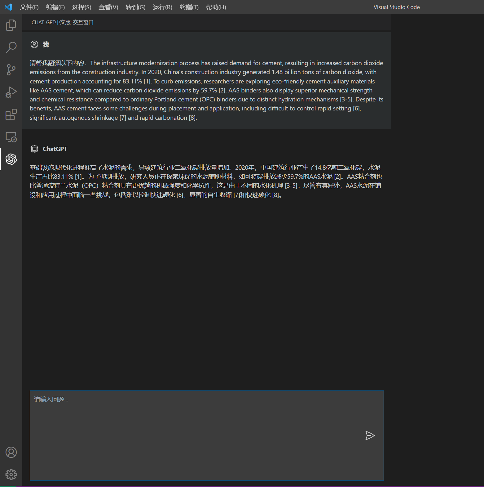

## VSCode ChatGpt 安装使用文档

**1.vscode下载地址**：[Visual Studio Code - Code Editing. Redefined](https://code.visualstudio.com/)

**2.安装vscode**

**3.安装chatgpt插件：**

​	1.进入插件列表，输入chatGPT，选择ChatGPT中文版

​	2.下载成功后，ctrl + shift + p 上方唤出指令栏，输入chatgpt，然后再下方指令列表里选择切换国外/国内模式（第一次使用默认国内），切换成国外模式时需要输入openAI账号api使用密钥

### 效果如下图：

