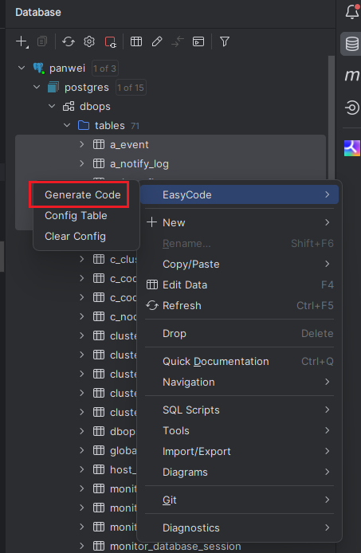

### 1. 安装

`ctrl+alt+s` 打开 `settings `配置页面, 进入 `Plugins` 中, 在 `Marketplace`  中搜索 `EasyCode`  , 然后进行安装, 重启生效


### 2. 模板配置

配置路径:  `settings > Other Settings > EasyCode`


#### 2.1 Type Mapper(数据库字段类型配置)


#### 2.2 Template(模板配置)

通常只进行 `entity` 和 `mapper` 的模板配置, 若 `service` 和 `controller` 在每次开发时都有通用方法, 则也可以根据需要自定义模板

**entity.java.vm**

```velocity
##引入宏定义
$!{define.vm}

##使用宏定义设置回调（保存位置与文件后缀）
#save("/entity", ".java")

##使用宏定义设置包后缀
#setPackageSuffix("entity")

##使用全局变量实现默认包导入
$!{autoImport.vm}
import java.io.Serializable;
import lombok.Data;

##使用宏定义实现类注释信息
#tableComment("实体类")
@Data
public class $!{tableInfo.name} implements Serializable {
    private static final long serialVersionUID = $!tool.serial();
#foreach($column in $tableInfo.fullColumn)
    #if(${column.comment})/**
     * ${column.comment}
     */#end

    private $!{tool.getClsNameByFullName($column.type)} $!{column.name};
#end

##foreach($column in $tableInfo.fullColumn)
##使用宏定义实现get,set方法
##getSetMethod($column)
##end
}
```

**mapper.java.vm - 基于 tkMybatis 实现的模板** 

```velocity
##定义初始变量
#set($tableName = $tool.append($tableInfo.name, "Mapper"))
##设置回调
$!callback.setFileName($tool.append($tableName, ".java"))
$!callback.setSavePath($tool.append($tableInfo.savePath, "/mapper"))

##使用宏定义设置包后缀
#if($tableInfo.savePackageName)package $!{tableInfo.savePackageName}.#{end}mapper;

##使用全局变量实现默认包导入
$!{autoImport.vm}
import com.sitech.ijcf.mybatis.JcfMapper;
import org.apache.ibatis.annotations.Mapper;
import $!{tableInfo.savePackageName}.entity.$!{tableInfo.name};

##使用宏定义实现类注释信息
@Mapper
public interface $!{tableInfo.name}Mapper extends JcfMapper<$!{tableInfo.name}> {


}
```

**说明文档**

```tcl
说明文档：
    属性
    $author 设置中的作者 java.lang.String
    $modulePath 选中的module路径 java.lang.String
    $projectPath 项目绝对路径 java.lang.String

    对象
    $tableInfo 表对象
        obj 表原始对象 com.intellij.database.model.DasTable
        preName 表前缀 java.lang.String
        name 表名（转换后的首字母大写）java.lang.String
        comment 表注释 java.lang.String
        fullColumn 所有列 java.util.List<ColumnInfo>
        pkColumn 主键列 java.util.List<ColumnInfo>
        otherColumn 其他列 java.util.List<ColumnInfo>,除主键以外的列
        savePackageName 保存的包名 java.lang.String
        savePath 保存路径 java.lang.String
        saveModelName 保存的model名称 java.lang.String
    columnInfo 列对象
        obj 列原始对象 com.intellij.database.model.DasColumn
        name 列名（首字母小写） java.lang.String
        comment 列注释 java.lang.String
        type 列类型（类型全名） java.lang.String
        shortType 列类型（短类型） java.lang.String
        custom 是否附加列 java.lang.Boolean
        ext 附加字段（Map类型） java.lang.Map<java.lang.String, java.lang.Object>
    $tableInfoList java.util.List<TableInfo>所有选中的表
    $importList 所有需要导入的包集合 java.util.Set<java.lang.String>

    回调
    &callback 回调对象
        setFileName(String) 设置文件储存名字
        setSavePath(String) 设置文件储存路径，默认使用选中路径
        setReformat(Boolean) 设置是否重新格式化生成后的代码，默认为界面选定值
        setWriteFile(Boolean) 设置是否生成文件，默认为true
    工具
    $tool
        firstUpperCase(String name) 首字母大写方法
        firstLowerCase(String name) 首字母小写方法
        getClsNameByFullName(String fullName) 通过包全名获取类名
        getJavaName(String name) 将下划线分割字符串转驼峰命名(属性名)
        getClassName(String name) 将下划线分割字符串转驼峰命名(类名)
        hump2Underline(String str) 将驼峰字符串转下划线字符串
        append(Object... objs) 多个数据进行拼接
        newHashSet(Object... objs) 创建一个HashSet对象
        newArrayList(Object... objs) 创建一个ArrayList对象
        newLinkedHashMap() 创建一个LinkedHashMap()对象
        newHashMap() 创建一个HashMap()对象
        getField(Object obj, String fieldName) 获取对象的属性值,可以访问任意修饰符修饰的属性.配合debug方法使用.
        call(Object... objs) 空白执行方法,用于调用某些方法时消除返回值
        debug(Object obj) 调式方法,用于查询对象结构.可查看对象所有属性与public方法
        serial() 随机获取序列化的UID
        service(String serviceName, Object... param)远程服务调用
        parseJson(String) 将字符串转Map对象
        toJson(Object, Boolean) 将对象转json对象，Boolean：是否格式化json，不填时为不格式化。
        toUnicode(String, Boolean) 将String转换为unicode形式，Boolean：是否转换所有符号，不填时只转换中文及中文符号。
    $time
        currTime(String format) 获取当前时间，指定时间格式（默认：yyyy-MM-dd HH:mm:ss）
    $generateService
        run(String, Map<String,Object>) 代码生成服务，参数1：模板名称，参数2：附加参数。
    $dasUtil Database提供的工具类，具体可方法请查看源码，适用于高端玩家
        $dasUtil.
    $dbUtil  Database提供的工具类，具体可方法请查看源码，适用于高端玩家
```

### 3. 具体使用

#### 3.1 使用 IDEA 数据库连接工具, 连接数据库


#### 3.2 选择对应需要创建的表, ctrl+鼠标左键可复选, 右键选择 EasyCode > Generate Code



#### 3.3 生成文件

