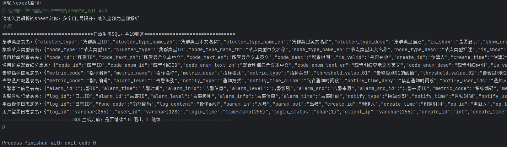

### 1. maven依赖

```xml
        <!-- hutool工具类 -->
        <dependency>
            <groupId>cn.hutool</groupId>
            <artifactId>hutool-all</artifactId>
            <version>5.7.22</version>
        </dependency>

        <!-- excel -->
        <dependency>
            <groupId>cn.afterturn</groupId>
            <artifactId>easypoi-base</artifactId>
            <version>4.4.0</version>
        </dependency>

        <dependency>
            <groupId>org.apache.logging.log4j</groupId>
            <artifactId>log4j-core</artifactId>
            <version>2.17.2</version>
        </dependency>
        <dependency>
            <groupId>org.apache.logging.log4j</groupId>
            <artifactId>log4j-api</artifactId>
            <version>2.17.2</version>
        </dependency>
```

### 2. GenerateSqlUtil.java

```java
import cn.hutool.core.util.StrUtil;
import cn.hutool.json.JSONObject;
import cn.hutool.poi.excel.WorkbookUtil;
import lombok.Data;
import org.apache.poi.ss.usermodel.Cell;
import org.apache.poi.ss.usermodel.Row;
import org.apache.poi.ss.usermodel.Sheet;
import org.apache.poi.ss.usermodel.Workbook;

import java.io.File;
import java.io.FileOutputStream;
import java.io.IOException;
import java.io.OutputStreamWriter;
import java.util.*;


public class GenerateSqlUtil {

    @Data
    public static class ExcelEntity {
        /**
         * 字段名
         */
        private String filedName;
        /**
         * 字段类型
         */
        private String filedType;
        /**
         * 字段注释
         */
        private String notes;
        /**
         * 字段属性
         */
        private String attribute;
        /**
         * 字段索引
         */
        private String index;
    }


    public static void main(String[] args) throws IOException {
        generateSql();
    }

    /**
     * 生成sql文件
     */
    private static void generateSql() throws IOException{
        System.out.println("请输入excel路径：");
        Scanner sc = new Scanner(System.in);
        String filePath = sc.next();
        System.out.println("请输入要解析的sheet名称，多个用,号隔开，输入全部为全部解析");
        String sheetName = sc.next();
        List<Map<String, Object>> result = readExcel(filePath,sheetName);
        System.out.println("================================开始生成SQL，共"+result.size()+"张表================================");
        StringBuilder sb = new StringBuilder();
        StringBuilder indexSb = null;
        for (Map<String, Object> map : result) {
            JSONObject json = new JSONObject(true);// 有序
            List<ExcelEntity> list = (List<ExcelEntity>) map.get("list");
            String tableName = (String) map.get("tableName"); //表名
            String tableNotes = (String) map.get("tableNotes"); //注释
            sb.append(String.format("-- %s：%s\n", tableName, tableNotes));
            sb.append(String.format("DROP TABLE IF EXISTS %s;\n", tableName));
            sb.append(String.format("CREATE TABLE %s (\n", tableName));
            int size = list.size();
            indexSb = new StringBuilder();
            for (int i = 0; i < size; i++) {
                ExcelEntity entity = list.get(i);
                sb.append(String.format("\t%s %s", entity.getFiledName(), entity.getFiledType()));
                String type = entity.getFiledType();
                String attribute = entity.getAttribute();
                if (attribute.contains("必填")) sb.append(" NOT NULL ");
                else sb.append(" ");
//                sb.append(String.format("'%s'", entity.getNotes()));
                if (StrUtil.isNotBlank(entity.getIndex())) { //设置索引
                    //INDEX `index_name`(`field1`, `field2`) USING BTREE
                    indexSb.append("\tINDEX `");
                    String[] index = entity.getIndex().split(":");
                    indexSb.append(index[0]);
                    indexSb.append("`(`");
                    indexSb.append(index[1]);
                    indexSb.append("`)");
                    indexSb.append(" USING BTREE,\n");
                }
                if (i < size - 1 || indexSb.length() > 0) sb.append(",");
                sb.append("\n");
                json.putOpt(entity.getFiledName(),entity.getNotes());
            }
            if (indexSb.length() > 0) {
                sb.append(indexSb.substring(0, indexSb.lastIndexOf(",")));
                sb.append("\n");
            }
//            sb.append(String.format(") ENGINE = InnoDB CHARACTER SET = utf8mb4 COLLATE = utf8mb4_0900_ai_ci COMMENT = '%s' ROW_FORMAT = Dynamic;", tableNotes));
            sb.append(");\n\n");
            System.out.println(tableNotes+"表："+json.toString());
        }

        for (Map<String, Object> map : result) {
            List<ExcelEntity> list = (List<ExcelEntity>) map.get("list");
            String tableName = (String) map.get("tableName"); //表名
            String tableNotes = (String) map.get("tableNotes"); //注释
            sb.append(String.format("-- %s：%s\n", tableName, tableNotes));
            int size = list.size();
            indexSb = new StringBuilder();
            List<String> primaryList = new ArrayList<>();
            for (int i = 0; i < size; i++) {
                ExcelEntity entity = list.get(i);
                String attribute = entity.getAttribute();
                if (attribute.contains("主键")) primaryList.add(entity.getFiledName());
                sb.append("COMMENT ON COLUMN ").append(tableName).append(".").append(entity.getFiledName()).append(" IS '").append(entity.getNotes()).append("';\n");
            }
            //ALTER TABLE t_cluster_user ADD CONSTRAINT t_cluster_user_pk PRIMARY KEY (user_id);
            sb.append("ALTER TABLE ").append(tableName).append(" ADD CONSTRAINT ").append(tableName).append("_pk PRIMARY KEY (");
            for(String s : primaryList){
                sb.append(s).append(",");
            }
            sb.deleteCharAt(sb.length()-1);
            sb.append(");");
            sb.append("\n\n");

        }

        File file = new File("C:\\Users\\18845\\Desktop\\1.sql");
        FileOutputStream fos1 = new FileOutputStream(file);
        OutputStreamWriter dos1 = new OutputStreamWriter(fos1);
        dos1.write(sb.toString());
        dos1.close();
        System.out.println("=========================SQL生成完成，是否继续？0 退出 1 继续=========================");
        String isExit = sc.next();
        if ("0".equals(isExit)) System.exit(0);
        generateSql();
    }

    /**
     * 根据文件路径解析文件
     * @param filePath   文件路径
     * @param sheetName  要解析的sheet名称
     */
    private static List<Map<String, Object>> readExcel(String filePath,String sheetName) {
        List<Map<String, Object>> result = new ArrayList<>();
        File file = new File(filePath);
        Workbook book = WorkbookUtil.createBook(file);
        if ("全部".equals(sheetName)){ // 全部解析
            int sheetNum = book.getNumberOfSheets();
            for (int i = 0; i < sheetNum; i++) {
                result.add(readExcel(book.getSheetAt(i)));
            }
        }else { // 只解析输入的指定sheet
            String[] split = sheetName.split(",");
            for (int i = 0; i < split.length; i++) {
                result.add(readExcel(book.getSheet(split[i])));
            }
        }
        return result;
    }

    /**
     * 读取指定sheet的数据，获取表名，字段名、字段类型、字段注释
     */
    private static Map<String, Object> readExcel(Sheet sheet) {
        Map<String, Object> map = new HashMap<>();
        List<ExcelEntity> list = new ArrayList<>();
        //第一行是标题，默认是注释:表名
        Row titleRow = sheet.getRow(0);
        String title = titleRow.getCell(0).toString();
        map.put("tableName", title.split(":")[1]);
        map.put("tableNotes", title.split(":")[0]);
        //第二行是表头，不读取。第三行开始才是数据
        int lastRowNum = sheet.getLastRowNum();
        for (int i = 2; i <= lastRowNum; i++) {
            list.add(getEntity(sheet.getRow(i)));
        }
        map.put("list", list);
        return map;
    }

    private static ExcelEntity getEntity(Row row) {
        ExcelEntity entity = new ExcelEntity();
        //列数：5列，分别是字段名、字段类型、字段注释、字段属性、字段索引
        for (int j = 0; j < 5; j++) {
            Cell cell = row.getCell(j);
            if (!Objects.isNull(cell)) {
                String str = cell.toString();
                if (StrUtil.isNotBlank(str)) {
                    switch (j) {
                        case 0: entity.setFiledName(str); break;
                        case 1: entity.setFiledType(str); break;
                        case 2: entity.setNotes(str); break;
                        case 3: entity.setAttribute(str); break;
                        case 4: entity.setIndex(str); break;
                    }
                }
            }
        }
        return entity;
    }
}
```

### 3. 使用



### 4. excel模板样式

